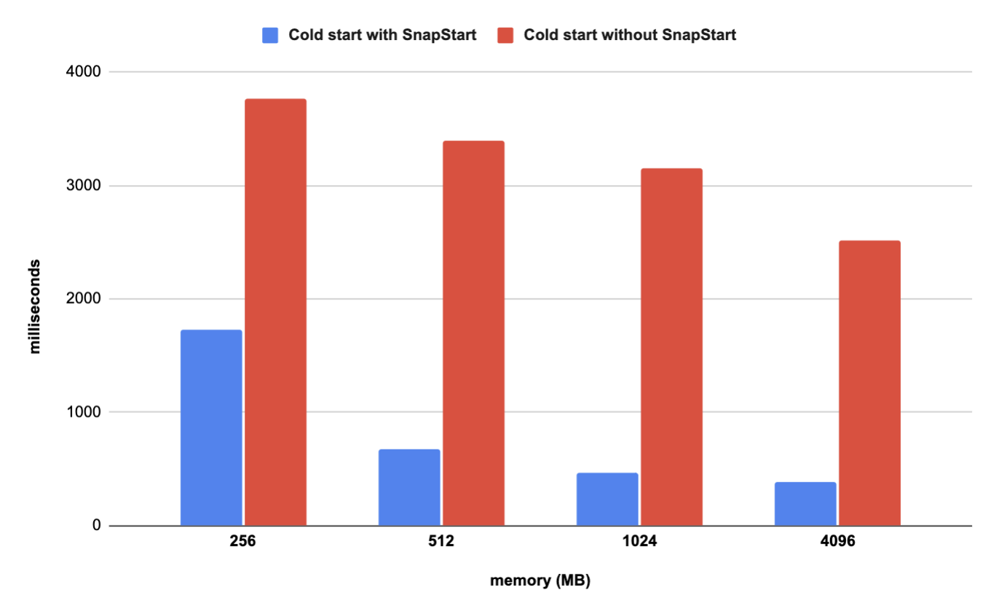
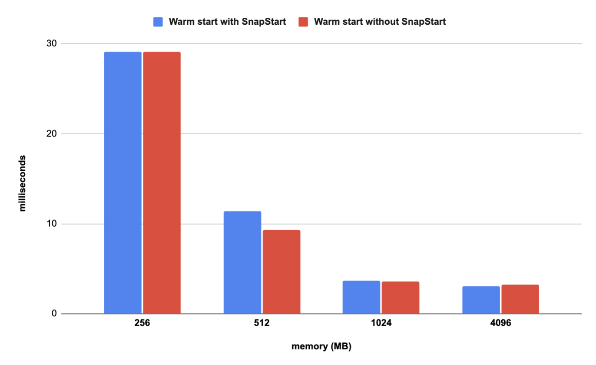

# Micronaut framework on AWS Lambda
Micronaut like Quarkus is a relatively newer framework, but it has been gaining popularity in recent years. It has a very spring-inspired programming model. It also uses Reactor (instead of Vert.x that Quarkus use). So if you are coming from a Spring world, in Micronaut you will find many similar patterns, techniques e.g. Mono and Flux from Reactor core. At the same time Micronaut aims to avoid downsides of Spring. It minimizes using reflections and proxies and doesn't use runtime bytecode generation. The source I found says that performance is a tiny bit better with Quarkus, but it's just negligible value.

### Build & install

```bash
mvn clean package 

# To deploy Lambda without SnapStart
sam deploy -t template.yaml

# To deploy Lambda with SnapStart
sam deploy -t template.snapstart.yaml
```

### Delete stack

```bash
sam delete
```

### Load test

```bash
./load-test.sh
```


### Measurements

**Without SnapStart**

<table class="table-bordered">
        <tr>
            <th colspan="2" style="horizontal-align : middle;text-align:center;"></th>
            <th colspan="4" style="horizontal-align : middle;text-align:center;">Cold Start (ms)</th>
            <th colspan="4" style="horizontal-align : middle;text-align:center;">Warm Start (ms)</th>           
        </tr>
        <tr>
            <th scope="col"> memory (MB)</th>
            <th scope="col">error rate</th>
            <th scope="col">p50</th>
            <th scope="col">p90</th>
            <th scope="col">p99</th>
            <th scope="col">max</th>
            <th scope="col">p50</th>
            <th scope="col">p90</th>
            <th scope="col">p99</th>
            <th scope="col">max</th>
        </tr>        
        <tr>
            <th>128</th>
            <td>100%</td>
            <td>N/A</td>
            <td>N/A</td>
            <td>N/A</td>
            <td>N/A</td>
            <td>N/A</td>
            <td>N/A</td>
            <td>N/A</td>
            <td>N/A</td>
        </tr>
        <tr>
            <th>256</th>
            <td>0%</td>
            <td>3758.9</td>
            <td>3912.2</td>
            <td>4362.3</td>
            <td>4262.7</td>
            <td>29.1</td>
            <td>46.8</td>
            <td>174.1</td>
            <td>315.7</td>
        </tr>
        <tr>
            <th>512</th>
            <td>0%</td>
            <td>3391.1</td>
            <td>3626</td>
            <td>3916.1</td>
            <td>3941.4</td>
            <td>9.3</td>
            <td>18.9</td>
            <td>55</td>
            <td>151.1</td>
        </tr>
        <tr>
            <th>1024</th>
            <td>0%</td>
            <td>3146.2</td>
            <td>3357.5</td>
            <td>3680.2</td>
            <td>3723.9</td>
            <td>3.6</td>
            <td>9.6</td>
            <td>25.7</td>
            <td>82</td>
        </tr>
        <tr>
            <th>4096</th>
            <td>0%</td>
            <td>2517.6</td>
            <td>2628.2</td>
            <td>2738.1</td>
            <td>2881.9</td>
            <td>3.2</td>
            <td>4.6</td>
            <td>12.7</td>
            <td>45.9</td>
        </tr>
</table>

**With SnapStart**

<table class="table-bordered">
        <tr>
            <th colspan="2" style="horizontal-align : middle;text-align:center;"></th>
            <th colspan="4" style="horizontal-align : middle;text-align:center;">Cold Start (ms)</th>
            <th colspan="4" style="horizontal-align : middle;text-align:center;">Warm Start (ms)</th>           
        </tr>
        <tr>
            <th scope="col"> memory (MB)</th>
            <th scope="col">error rate</th>
            <th scope="col">p50</th>
            <th scope="col">p90</th>
            <th scope="col">p99</th>
            <th scope="col">max</th>
            <th scope="col">p50</th>
            <th scope="col">p90</th>
            <th scope="col">p99</th>
            <th scope="col">max</th>
        </tr>        
        <tr>
            <th>128</th>
            <td>100%</td>
            <td>N/A</td>
            <td>N/A</td>
            <td>N/A</td>
            <td>N/A</td>
            <td>N/A</td>
            <td>N/A</td>
            <td>N/A</td>
            <td>N/A</td>
        </tr>
        <tr>
            <th>256</th>
            <td>0%</td>
            <td>1725.4</td>
            <td>1814.6</td>
            <td>2257.8</td>
            <td>2289.8</td>
            <td>29.1</td>
            <td>44.2</td>
            <td>175.2</td>
            <td>231.8</td>
        </tr>
        <tr>
            <th>512</th>
            <td>0%</td>
            <td>677</td>
            <td>729.7</td>
            <td>798.4</td>
            <td>809.1</td>
            <td>11.4</td>
            <td>20.5</td>
            <td>65.8</td>
            <td>91</td>
        </tr>
        <tr>
            <th>1024</th>
            <td>0%</td>
            <td>468.6</td>
            <td>518.9</td>
            <td>626.3</td>
            <td>1373.1</td>
            <td>3.7</td>
            <td>8.6</td>
            <td>25.5</td>
            <td>97.7</td>
        </tr>
        <tr>
            <th>4096</th>
            <td>0%</td>
            <td>388.8</td>
            <td>439.2</td>
            <td>562.1</td>
            <td>594.3</td>
            <td>3.1</td>
            <td>4.9</td>
            <td>16.7</td>
            <td>67.1</td>
        </tr>
</table>

**Median (p50)**

<p align="center">
  
</p>
<p align="center">
    
</p>
