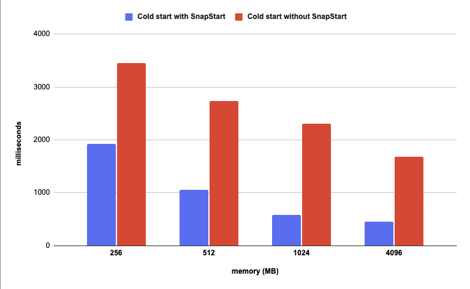
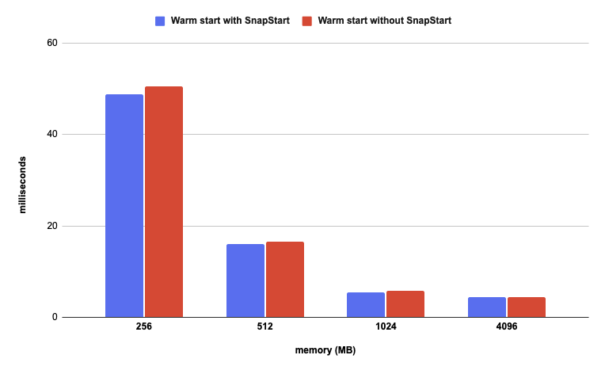

# Quarkus framework on AWS Lambda

### Build & install

```bash
mvn clean package 

# To deploy Lambda without SnapStart
sam deploy -t template.yaml

# To deploy Lambda with SnapStart
sam deploy -t template.snapstart.yaml
```

### Delete stack

```bash
sam delete
```

### Measurements

**Without SnapStart**

<table class="table-bordered">
        <tr>
            <th colspan="2" style="horizontal-align : middle;text-align:center;"></th>
            <th colspan="4" style="horizontal-align : middle;text-align:center;">Cold Start (ms)</th>
            <th colspan="4" style="horizontal-align : middle;text-align:center;">Warm Start (ms)</th>           
        </tr>
        <tr>
            <th scope="col"> memory (MB)</th>
            <th scope="col">error rate</th>
            <th scope="col">p50</th>
            <th scope="col">p90</th>
            <th scope="col">p99</th>
            <th scope="col">max</th>
            <th scope="col">p50</th>
            <th scope="col">p90</th>
            <th scope="col">p99</th>
            <th scope="col">max</th>
        </tr>        
        <tr>
            <th>128</th>
            <td>100%</td>
            <td>N/A</td>
            <td>N/A</td>
            <td>N/A</td>
            <td>N/A</td>
            <td>N/A</td>
            <td>N/A</td>
            <td>N/A</td>
            <td>N/A</td>
        </tr>
        <tr>
            <th>256</th>
            <td>0%</td>
            <td>3452.7</td>
            <td>3543.6</td>
            <td>3732.7</td>
            <td>3757.3</td>
            <td>50.5</td>
            <td>73.1</td>
            <td>213.8</td>
            <td>317.2</td>
        </tr>
        <tr>
            <th>512</th>
            <td>0%</td>
            <td>2738.2</td>
            <td>2818.7</td>
            <td>2890</td>
            <td>2899.4</td>
            <td>16.5</td>
            <td>34</td>
            <td>93.1</td>
            <td>189.5</td>
        </tr>
        <tr>
            <th>1024</th>
            <td>0%</td>
            <td>2305.7</td>
            <td>2387.7</td>
            <td>2512.6</td>
            <td>4079.8</td>
            <td>5.8</td>
            <td>11.4</td>
            <td>14.5</td>
            <td>70.2</td>
        </tr>
        <tr>
            <th>4096</th>
            <td>0%</td>
            <td>1676.2</td>
            <td>1823</td>
            <td>2028.8</td>
            <td>2046.3</td>
            <td>4.4</td>
            <td>7.7</td>
            <td>18.4</td>
            <td>42.6</td>
        </tr>
</table>


**With SnapStart**

<table class="table-bordered">
        <tr>
            <th colspan="2" style="horizontal-align : middle;text-align:center;"></th>
            <th colspan="4" style="horizontal-align : middle;text-align:center;">Cold Start (ms)</th>
            <th colspan="4" style="horizontal-align : middle;text-align:center;">Warm Start (ms)</th>           
        </tr>
        <tr>
            <th scope="col"> memory (MB)</th>
            <th scope="col">error rate</th>
            <th scope="col">p50</th>
            <th scope="col">p90</th>
            <th scope="col">p99</th>
            <th scope="col">max</th>
            <th scope="col">p50</th>
            <th scope="col">p90</th>
            <th scope="col">p99</th>
            <th scope="col">max</th>
        </tr>        
        <tr>
            <th>128</th>
            <td>100%</td>
            <td>N/A</td>
            <td>N/A</td>
            <td>N/A</td>
            <td>N/A</td>
            <td>N/A</td>
            <td>N/A</td>
            <td>N/A</td>
            <td>N/A</td>
        </tr>
        <tr>
            <th>256</th>
            <td>0%</td>
            <td>1918.5</td>
            <td>1977.8</td>
            <td>2034.1</td>
            <td>2063.4</td>
            <td>48.8</td>
            <td>63.5</td>
            <td>168.2</td>
            <td>264.1</td>
        </tr>
        <tr>
            <th>512</th>
            <td>0%</td>
            <td>1059.1</td>
            <td>1115.8</td>
            <td>1144.8</td>
            <td>1148.2</td>
            <td>16</td>
            <td>33.7</td>
            <td>94.6</td>
            <td>172.5</td>
        </tr>
        <tr>
            <th>1024</th>
            <td>0%</td>
            <td>583.38</td>
            <td>622</td>
            <td>690.4</td>
            <td>711.2</td>
            <td>5.5</td>
            <td>13.6</td>
            <td>37.9</td>
            <td>64.3</td>
        </tr>
        <tr>
            <th>4096</th>
            <td>0%</td>
            <td>455.7</td>
            <td>498.6</td>
            <td>556</td>
            <td>566.1</td>
            <td>4.3</td>
            <td>7.4</td>
            <td>20.2</td>
            <td>57.2</td>
        </tr>
</table>


**Median (p50)**

<p align="center">
  
</p>
<p align="center">
    
</p>
