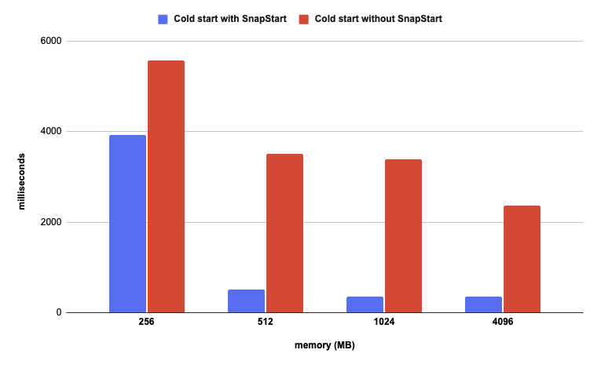
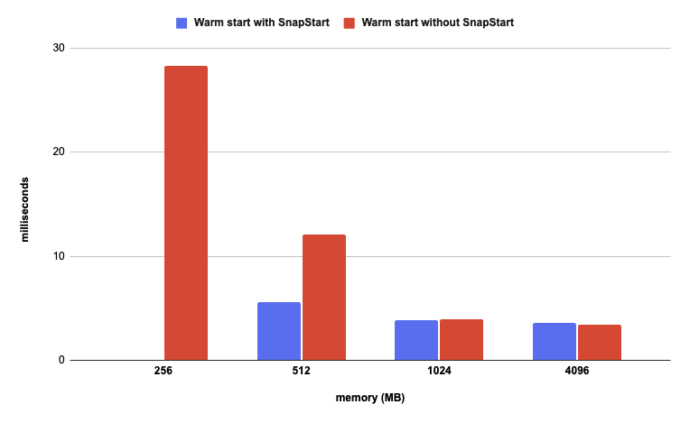

# Spring Boot framework on AWS Lambda

Spring Boot is the most widely adopted and well-established of the three frameworks. Pivotal product has also the largest and most active community. It has been around for over a decade. It provides a wide range of features and is highly configurable, making it a good choice for large and complex applications. However, Spring Boot is more resource-intensive than Quarkus and Micronaut. Spring Boot uses a traditional, Just-in-Time (JIT) compilation approach, which can result in longer startup times compared to Quarkus and Micronaut, which use Ahead-of-Time (AOT) compilation. AOT compilation pre-compiles the code at build time, resulting in faster startup times and smaller memory footprint. Also, runtime dependency injection adds some overhead and complexity to spring-based workloads.

### Build & install

```bash
mvn clean package 

# To deploy Lambda without SnapStart
sam deploy -t template.yaml

# To deploy Lambda with SnapStart
sam deploy -t template.snapstart.yaml
```

### Delete stack

```bash
sam delete
```

### Load test

```bash
./load-test.sh
```

### Measurements

**Without SnapStart**

<table class="table-bordered">
        <tr>
            <th colspan="2" style="horizontal-align : middle;text-align:center;"></th>
            <th colspan="4" style="horizontal-align : middle;text-align:center;">Cold Start (ms)</th>
            <th colspan="4" style="horizontal-align : middle;text-align:center;">Warm Start (ms)</th>           
        </tr>
        <tr>
            <th scope="col"> memory (MB)</th>
            <th scope="col">error rate</th>
            <th scope="col">p50</th>
            <th scope="col">p90</th>
            <th scope="col">p99</th>
            <th scope="col">max</th>
            <th scope="col">p50</th>
            <th scope="col">p90</th>
            <th scope="col">p99</th>
            <th scope="col">max</th>
        </tr>        
        <tr>
            <th>128</th>
            <td>100%</td>
            <td>N/A</td>
            <td>N/A</td>
            <td>N/A</td>
            <td>N/A</td>
            <td>N/A</td>
            <td>N/A</td>
            <td>N/A</td>
            <td>N/A</td>
        </tr>
        <tr>
            <th>256</th>
            <td>10,5%</td>
            <td>5584.1</td>
            <td>6867.7</td>
            <td>7119.3</td>
            <td>7157.4</td>
            <td>28.3</td>
            <td>1135.7</td>
            <td>3582.5</td>
            <td>3808.8</td>
        </tr>
        <tr>
            <th>512</th>
            <td>0%</td>
            <td>3515.4</td>
            <td>3647.8</td>
            <td>3725.2</td>
            <td>3762.8</td>
            <td>12.1</td>
            <td>20.2</td>
            <td>52.9</td>
            <td>180.6</td>
        </tr>
        <tr>
            <th>1024</th>
            <td>0%</td>
            <td>3396.6</td>
            <td>3512.3</td>
            <td>3599.6</td>
            <td>3599.6</td>
            <td>3.9</td>
            <td>9.2</td>
            <td>18.5</td>
            <td>94.7</td>
        </tr>
        <tr>
            <th>4096</th>
            <td>0%</td>
            <td>2366.4</td>
            <td>2525.2</td>
            <td>3127.5</td>
            <td>3191.1</td>
            <td>3.4</td>
            <td>5</td>
            <td>10.6</td>
            <td>33.4</td>
        </tr>
</table>

**With SnapStart**

<table class="table-bordered">
        <tr>
            <th colspan="2" style="horizontal-align : middle;text-align:center;"></th>
            <th colspan="4" style="horizontal-align : middle;text-align:center;">Cold Start (ms)</th>
            <th colspan="4" style="horizontal-align : middle;text-align:center;">Warm Start (ms)</th>           
        </tr>
        <tr>
            <th scope="col"> memory (MB)</th>
            <th scope="col">error rate</th>
            <th scope="col">p50</th>
            <th scope="col">p90</th>
            <th scope="col">p99</th>
            <th scope="col">max</th>
            <th scope="col">p50</th>
            <th scope="col">p90</th>
            <th scope="col">p99</th>
            <th scope="col">max</th>
        </tr>        
        <tr>
            <th>128</th>
            <td>100%</td>
            <td>N/A</td>
            <td>N/A</td>
            <td>N/A</td>
            <td>N/A</td>
            <td>N/A</td>
            <td>N/A</td>
            <td>N/A</td>
            <td>N/A</td>
        </tr>
        <tr>
            <th>256</th>
            <td>60.3%</td>
            <td>3920</td>
            <td>5027.8</td>
            <td>5149.8</td>
            <td>5173.7</td>
            <td>2399.7</td>
            <td>3717.8</td>
            <td>3931.8</td>
            <td>4141.4</td>
        </tr>
        <tr>
            <th>512</th>
            <td>0%</td>
            <td>515.3</td>
            <td>554.2</td>
            <td>598.7</td>
            <td>611.4</td>
            <td>5.6</td>
            <td>18.6</td>
            <td>37.1</td>
            <td>54.3</td>
        </tr>
        <tr>
            <th>1024</th>
            <td>0%</td>
            <td>347.3</td>
            <td>381.1</td>
            <td>451.6</td>
            <td>1270</td>
            <td>3.8</td>
            <td>9.1</td>
            <td>17.1</td>
            <td>32.3</td>
        </tr>
        <tr>
            <th>4096</th>
            <td>0%</td>
            <td>350.4</td>
            <td>417.3</td>
            <td>604.7</td>
            <td>641</td>
            <td>3.6</td>
            <td>5.7</td>
            <td>16.9</td>
            <td>65.1</td>
        </tr>
</table>

**Median (p50)**

<p align="center">
  
</p>
<p align="center">
    
</p>


* Missing data for Warm start with 256 MB is because the read was with a large anomaly that spoils chart presentation.
